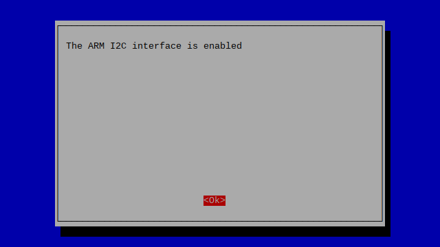
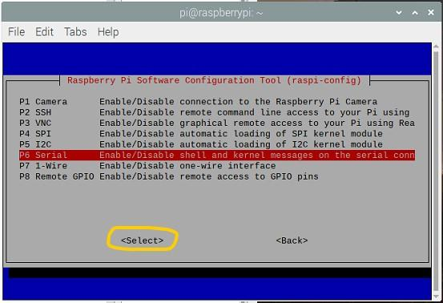
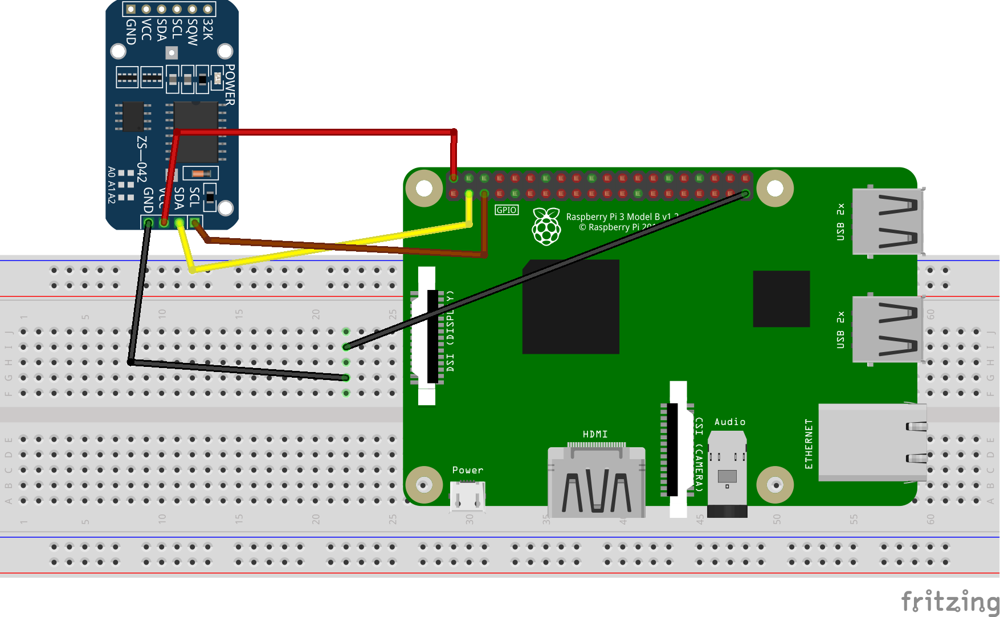

<p align="center">
  <a href="" rel="noopener">
 </a>
</p>

<h3 align="center">Raspberry Pi NTP Server with RTC</h3>

<div align="center">

[]()


</div>

---


<p align="center"> Raspberry Pi NTP Server with RTC
    <br> 
</p>

## 📝 Table of Contents

- [About](#about)
- [Getting Started](#getting_started)
- [Prerequisites](#deployment)
- [Installation and Config](#Installation_and_Config)
- [Test](#test)
- [Circuit](#circuit)
- [Smartphone App](#app)
- [Built Using](#built_using)
- [Authors](#authors)

## 🧐 About <a name = "about"></a>

This repo contains circuit, firmware and backend for Raspberry Pi NTP Server with RTC Project.

## 🏁 Getting Started <a name = "getting_started"></a>

These instructions will get you a copy of the project up and running on your local machine for development and testing purposes. See [deployment](#deployment) for notes on how to deploy the project on a live system.

### Prerequisites <a name = "Prerequisites"></a>

What things you need to install the software and how to install them.

```
- Raspberry Pi Model 3B, 3B+, 4B or CM4
```

## Installation and Configuration <a name = "Installation_and_Config"></a>

A step by step series that covers how to get the Firmware running.

### Raspberry Pi Firmware Pre-Reqs

1.  Download and install the latest Raspberry Pi OS Desktop image to your SD card
2.  Open the terminal and execute the following command
    ```sudo raspi-config```
3. Then follow the following pictures to enable I2C bus on you raspberry pi

* 
* 
* 
* 
* 

* Then do the same for Serial(UART)

* 


### Configuring Raspberry Pi
#### DS3231 Configurations
  1.  Copy Firmware folder to the desktop of your Raspberry Pi, open the terminal of your Raspberry Pi and execute the following commands

  - ```sudo apt-get update```
  - ```sudo apt-get upgrade```
  - ```sudo apt install python3-pip```
  - ```sudo apt-get -y remove fake-hwclock```
  - ```sudo update-rc.d -f fake-hwclock remove```
  - ```sudo systemctl disable fake-hwclock```
  - ```sudo nano /boot/config.txt```
  - At the end of the file add this line `dtoverlay=i2c-rtc,ds3231`
  - Then press CTRL+O and CTRL+X to save and exit
  - ```sudo nano /lib/udev/hwclock-set```
  - and put # sign before the following lines
  
* #if [ -e /run/systemd/system ] ; then
* #exit 0
* #fi
* #/sbin/hwclock --rtc=$dev --systz --badyear
* #/sbin/hwclock --rtc=$dev --systz

- Then press CTRL+O and CTRL+X to save and exit
- ```sudo hwclock -r```
- You might see that the date/time are invalid, connect your raspberry pi to the internet and run the following commands
- ```sudo hwclock -w```
- ```sudo hwclock -r```
- ```sudo reboot```

Now your Raspberry Pi is using external RTC module for time.

#### NTP Server Configurations

Execute the following commands to set NTP

- ```sudo apt-get install ntp```
- ​```/etc/init.d/ntp stop```
- ```​/etc/init.d/ntp start```
- Get the NTP server links of your country from pool.ntp.org
- ```sudo nano /etc/ntp.conf```
- Replace the lines starting with `server` with the server links you got in the above step.
- Then press CTRL+O and CTRL+X to save and exit
- ```/etc/init.d/ntp restart```
- ```sudo systemctl enable ntp.service```
- ```sudo reboot```
  
Now you can use your rasberry pi IP address in your ESP32 to get the time or you can also use raspberrypi.local instead of the IP address.


## ⛏️ Testing <a name = "test"></a>

1.  The Firmware can be tested on Raspberry Pi 3B, 3B+ or 4B with the following modifications
  1.  Connect the sensor as shown in the Circuit Diagram section below.

## 🔌 Circuit Diagram <a name = "circuit"></a>


* RPi 3,4 GPIOs Pinout


### Circuit

```http
Pins connections
```

| RTC DS3231 | Raspberry Pi |
| :--- | :--- |
| `SCL` | `GPIO2` | 
| `SDA` | `GPIO3` | 
| `VCC` | `5V` | 
| `GND` | `GND` | 





## Components Used

1.  Any Raspberry Pi (https://www.amazon.com/CanaKit-Raspberry-Micro-Supply-Listed/dp/B01C6FFNY4/ref=sr_1_1?dchild=1&keywords=raspberry+pi+3&qid=1632029848&sr=8-1)
2.  RTC DS3231(https://www.amazon.de/Echtzeit-Uhr-Modul-RTC-Sensor-Pr%C3%A4zision-AT24C32-Raspberry/dp/B07V68443F/ref=sr_1_5?__mk_de_DE=%C3%85M%C3%85%C5%BD%C3%95%C3%91&keywords=ds3231&qid=1636619193&sr=8-5)
3.  MCP3008
4.  Logic Level Converter(https://www.amazon.com/SparkFun-Logic-Level-Converter-Bi-Directional/dp/B01N30ZCW9/ref=sr_1_6?crid=2NOGIA43AG9OS&dchild=1&keywords=logic+level+converter&qid=1632029917&sprefix=logic+level%2Caps%2C463&sr=8-6)


## ⛏️ Built Using <a name = "built_using"></a>

- [Python3](https://www.python.org/) - Raspberry Pi FW

## ✍️ Authors <a name = "authors"></a>

- [@Nauman3S](https://github.com/Nauman3S) - Development and Deployment
